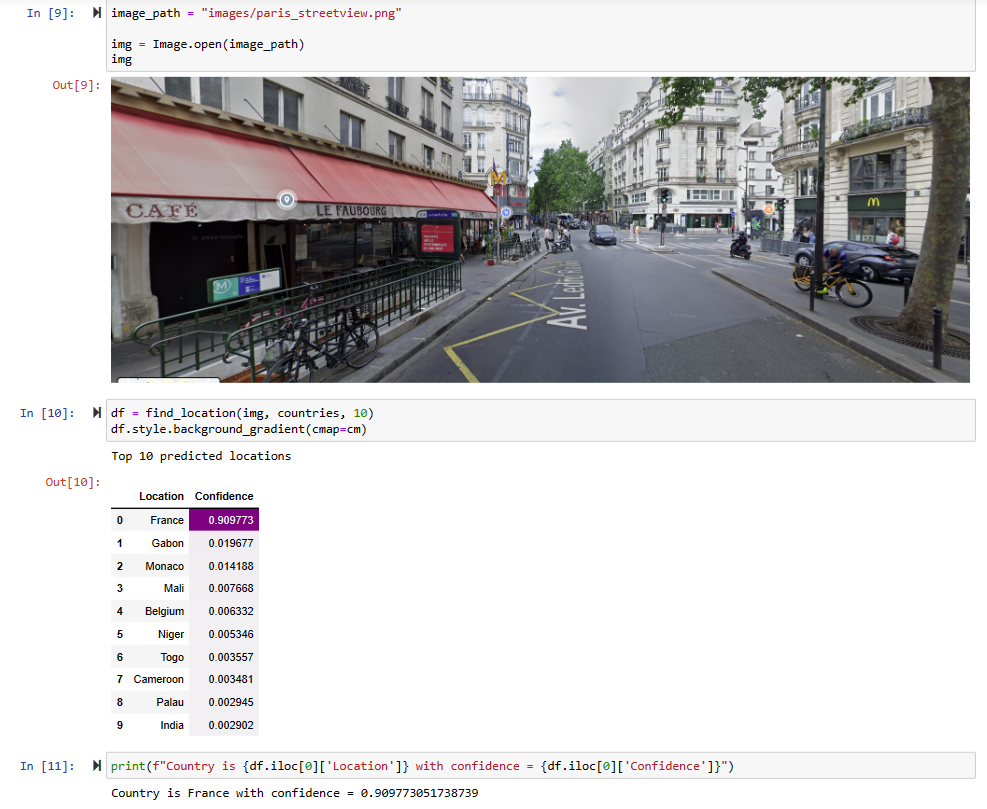

# StreetCLIP demo

**StreetCLIP** is a robust foundation model for open-domain image geolocalization and other geographic and climate-related tasks.

Trained on an original dataset of 1.1 million street-level urban and rural geo-tagged images, it achieves state-of-the-art performance on multiple open-domain image geolocalization benchmarks in **zero-shot**, outperforming supervised models trained on millions of images.

## Example

## Author
04-Oct-2023

Serge Retkowsky | serge.retkowsky@microsoft.com | https://www.linkedin.com/in/serger/
